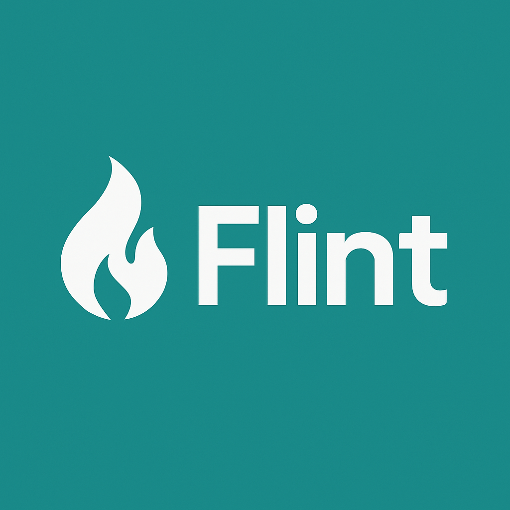

<p align="center">
  
</p>

<h1 align="center">Flint</h1>
<p align="center">A blazing fast and lightweight web framework for Go.</p>

[](https://flintgo.netlify.app)

[](https://t.me/flint_framework)

[](https://t.me/flint_framework_tr)

[](https://x.com/flintframework)

[](https://youtube.com/@flint_framework)


---

## ⚡️ What is Flint?

Flint is a simple and minimal backend framework written in Go, made for fast API development with clean structure and easy usage. 

## 🐾 Flinex
<p align="center">
  
  <br>
</p>

## 🚀 Quick Start

```bash
go get github.com/coderianx/flint
```

```go
package main

import "github.com/coderianx/flint"

func main() {
    app := flint.NewServer()

    app.Handle("/", func(ctx flint.Context) {
        ctx.String("Hello from Flint!")
    })

    app.Run(":8080")
}
```
---

## 📄 License

This project is licensed under the MIT License - see the [LICENSE](LICENSE) file for details.

> Built with ❤️ using Go
